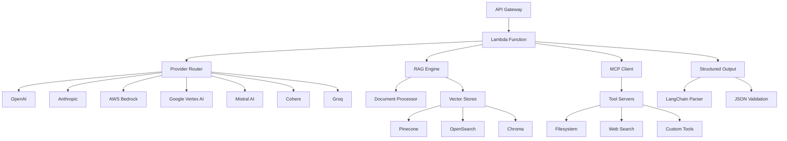

# Omni-LLM: Universal AI Lambda Gateway

<div align="center">


[](https://opensource.org/licenses/MIT)
[](https://www.python.org/downloads/)
[](https://aws.amazon.com/lambda/)
[](https://langchain.com/)

**A serverless AWS Lambda function with LangChain native fallback that provides universal AI access through a single API endpoint, supporting automatic provider switching, RAG capabilities, and MCP tool integration.**

[🚀 Quick Start](#-quick-start) • [📖 Documentation](#-documentation) • [🏗️ Architecture](#️-architecture) • [🤝 Contributing](#-contributing)

</div>

---

## 🌟 Features

### 🤖 Universal LLM Support
- **OpenAI**: GPT-4, GPT-3.5, GPT-4-turbo with function calling
- **Anthropic**: Claude 3.5 Sonnet, Claude 3 Haiku/Opus with vision
- **AWS Bedrock**: All foundation models with multi-modal support
- **Google Vertex AI**: Gemini 1.5 Pro/Flash with 2M context
- **Mistral AI**: Mistral Large, Medium, Small with function calling
- **Cohere**: Command R+, Command R with reranking
- **Groq**: Ultra-fast inference (< 100ms) with Llama, Mixtral, Gemma
- **Custom Providers**: OpenAI-compatible endpoints

### 📊 Structured Output
- **User-Defined Formats**: Specify exact JSON structure you want
- **100% Compliance**: LangChain's `with_structured_output()` guarantees format match
- **Complex Schemas**: Support for nested objects, arrays, and validation
- **Type Safety**: Automatic validation and error handling

### 🔍 Advanced RAG
- **Multiple Vector Stores**: Pinecone, OpenSearch Serverless, Chroma, FAISS, Weaviate, Qdrant
- **Smart Document Processing**: PDF, DOCX, HTML, TXT with intelligent chunking
- **Flexible Embeddings**: OpenAI, Cohere, AWS Bedrock Titan, Google
- **S3 Integration**: Seamless document storage and retrieval

### 🛠️ MCP Integration
- **Dynamic Tool Discovery**: Model Context Protocol for runtime tool access
- **HTTP & stdio**: Multiple transport protocols
- **Tool Ecosystems**: Filesystem, web search, custom tools
- **LangChain Adapters**: Native integration with LangChain framework

### ⚡ Serverless Architecture
- **AWS Lambda**: Container-based deployment (up to 10GB)
- **ARM64 Optimized**: 20% cost savings with Graviton2
- **Auto-scaling**: Handle 1000+ concurrent requests
- **Cold Start < 3s**: Optimized for performance

### 🔐 Enterprise Security
- **API Key Management**: AWS Secrets Manager integration
- **Rate Limiting**: Per-client throttling and quotas
- **VPC Support**: Private network deployment
- **Audit Logging**: Comprehensive request/response tracking
- **GDPR Compliance**: Data minimization and retention policies

---

## 🚀 Quick Start

### Prerequisites
- AWS Account with appropriate permissions
- Docker for container builds
- Python 3.11+
- API keys for desired LLM providers

### 1. Clone Repository
```bash
git clone https://github.com/yet-market/omni-llm.git
cd omni-llm
```

### 2. Environment Setup
```bash
# Interactive setup (recommended)
./scripts/setup-env.sh

# Or manual setup
./scripts/setup-dev.sh
```

### 3. Local Testing
```bash
# Start local development server
./scripts/start-dev.sh

# Test basic functionality
curl -X POST http://localhost:8000/invoke \
  -H "Content-Type: application/json" \
  -H "x-api-key: dev-key-12345" \
  -d '{
    "prompt": "Explain quantum computing in simple terms",
    "model_name": "gpt-4o-mini",
    "enable_fallback": true
  }'
```

### 4. Structured Output Example
```bash
curl -X POST http://localhost:8000/invoke \
  -H "Content-Type: application/json" \
  -d '{
    "prompt": "Analyze the iPhone 15",
    "fallback_strategy": "quality_optimized",
    "structured_output_enabled": true,
    "structured_output_schema": {
      "product_name": "string",
      "price": "number",
      "pros": ["array"],
      "cons": ["array"],
      "rating": "number"
    }
  }'
```

### 4. Deploy to AWS
```bash
# Deploy to development environment (uses yet profile, eu-west-2)
./deployment/scripts/deploy.sh dev

# Your API keys from .env are automatically loaded as Lambda environment variables
```

---

## 📖 Documentation

- [📋 Complete Technical Specification](SPECIFICATION.md)
- [🚀 Deployment Guide](DEPLOYMENT.md)
- [⚙️ Environment Configuration](ENV_TEMPLATE.env)
- [🤝 Contributing Guidelines](CONTRIBUTING.md)
- [📝 Development Instructions](CLAUDE.md)
- [📊 Project Changelog](CHANGELOG.md)

---

## 🏗️ Architecture



### Key Components

- **🦜 LangChain Universal Provider**: Single provider with native fallback chains
- **🔄 Automatic Fallback**: Built-in `with_fallbacks()` for seamless provider switching
- **🔍 RAG Engine**: Advanced document retrieval and processing
- **🛠️ MCP Integration**: Dynamic tool discovery and execution
- **📊 Structured Parser**: Guaranteed JSON format compliance
- **⚡ Performance Optimizer**: Pre-configured fallback strategies, ARM64
- **🔐 Security Layer**: Authentication, rate limiting, encryption

---

## 💰 Cost Optimization

### Model Cost Comparison (per 1M tokens)
| Provider | Input | Output | Use Case |
|----------|-------|--------|----------|
| GPT-3.5 Turbo | $1.50 | $2.00 | Cost-effective general use |
| Claude 3 Haiku | $0.25 | $1.25 | Fast, lightweight tasks |
| Groq Llama | $0.05 | $0.08 | Ultra-fast inference |
| Mistral Small | $1.00 | $3.00 | Balanced performance/cost |

### Infrastructure Costs (ARM64)
- **Lambda**: $0.0000133334 per GB-second
- **API Gateway**: $3.50 per million requests
- **CloudWatch**: $0.50 per GB ingested

**Average cost**: < $0.01 per request for most use cases

---

## 🔧 Configuration Examples

### Basic Chat
```json
{
  "prompt": "What is artificial intelligence?",
  "model_name": "claude-3-5-sonnet-20241022",
  "fallback_strategy": "quality_optimized"
}
```

### RAG-Enabled Query
```json
{
  "prompt": "What are the key findings in the research papers?",
  "fallback_strategy": "balanced",
  "rag_enabled": true,
  "s3_bucket": "research-papers",
  "vector_store_type": "pinecone"
}
```

### MCP Tool Usage
```json
{
  "prompt": "Check the weather and read my calendar",
  "fallback_strategy": "performance_optimized",
  "mcp_enabled": true,
  "mcp_servers": ["weather_api", "calendar_api"]
}
```

### Structured Data Extraction
```json
{
  "prompt": "Extract contact information from this text: ...",
  "fallback_strategy": "quality_optimized",
  "structured_output_enabled": true,
  "structured_output_schema": {
    "contacts": [
      {
        "name": "string",
        "email": "string",
        "phone": "string",
        "company": "string"
      }
    ]
  }
}
```

---

## 🚦 Usage Examples

<details>
<summary><b>🐍 Python Client</b></summary>

```python
import requests
import json

def call_omni_llm(prompt, fallback_strategy="balanced", **kwargs):
    url = "https://your-api-gateway-url/invoke"
    payload = {
        "prompt": prompt,
        "fallback_strategy": fallback_strategy,
        "enable_fallback": True,
        **kwargs
    }
    
    response = requests.post(url, json=payload)
    return response.json()

# Basic usage
result = call_omni_llm(
    "Explain machine learning",
    fallback_strategy="quality_optimized"
)

# Structured output
result = call_omni_llm(
    "Analyze this product review",
    structured_output_enabled=True,
    structured_output_schema={
        "sentiment": "string",
        "score": "number",
        "key_points": ["array"]
    }
)
```
</details>

<details>
<summary><b>🌐 JavaScript/Node.js Client</b></summary>

```javascript
const axios = require('axios');

async function callOmniLLM(prompt, options = {}) {
  const url = 'https://your-api-gateway-url/invoke';
  const payload = {
    prompt,
    fallback_strategy: 'balanced',
    enable_fallback: true,
    ...options
  };
  
  try {
    const response = await axios.post(url, payload);
    return response.data;
  } catch (error) {
    console.error('Error:', error.response?.data || error.message);
    throw error;
  }
}

// Basic usage
const result = await callOmniLLM(
  "What is the capital of France?",
  { fallback_strategy: "performance_optimized" }
);

// Structured output
const analysis = await callOmniLLM(
  "Analyze this financial data",
  {
    structured_output_enabled: true,
    structured_output_schema: {
      summary: "string",
      recommendations: ["array"],
      risk_level: "string"
    }
  }
);
```
</details>

<details>
<summary><b>🔄 cURL Examples</b></summary>

```bash
# Basic text generation
curl -X POST https://your-api-gateway-url/invoke \
  -H "Content-Type: application/json" \
  -d '{
    "prompt": "Write a haiku about programming",
    "fallback_strategy": "quality_optimized"
  }'

# RAG query with custom settings
curl -X POST https://your-api-gateway-url/invoke \
  -H "Content-Type: application/json" \
  -d '{
    "prompt": "What does the documentation say about security?",
    "fallback_strategy": "balanced",
    "rag_enabled": true,
    "s3_bucket": "docs-bucket",
    "vector_store_type": "pinecone"
  }'

# Structured output for data extraction
curl -X POST https://your-api-gateway-url/invoke \
  -H "Content-Type: application/json" \
  -d '{
    "prompt": "Extract key metrics from this report: [report text]",
    "fallback_strategy": "quality_optimized",
    "structured_output_enabled": true,
    "structured_output_schema": {
      "revenue": "number",
      "growth_rate": "number", 
      "key_insights": ["array"],
      "risks": ["array"]
    }
  }'
```
</details>

---

## 🔍 Monitoring & Observability

### CloudWatch Dashboards
- Request volume and latency metrics
- Error rates by provider and model
- Cost tracking and optimization recommendations
- Performance benchmarks across providers

### X-Ray Tracing
- End-to-end request tracing
- Provider-specific performance analysis
- RAG pipeline optimization insights
- MCP tool execution monitoring

### Custom Metrics
```python
# Built-in metrics
- omni_llm.requests.total
- omni_llm.requests.duration
- omni_llm.errors.by_provider
- omni_llm.costs.by_model
- omni_llm.rag.retrieval_time
- omni_llm.mcp.tool_calls
```

---

## 🧪 Testing

### Unit Tests
```bash
# Run all tests
pytest tests/ -v --cov=src

# Run specific test categories
pytest tests/test_providers/ -v
pytest tests/test_rag/ -v
pytest tests/test_mcp/ -v
```

### Integration Tests
```bash
# Test with real providers (requires API keys)
pytest tests/integration/ -v --integration

# Load testing
locust -f tests/load/locustfile.py --host=https://your-api-url
```

### Local Development
```bash
# Start local server
python src/lambda_function.py

# Run development tests
python tests/test_local.py
```

---

## 🤝 Contributing

We welcome contributions from the community! Please see our [Contributing Guide](CONTRIBUTING.md) for details.

### Development Setup
```bash
# Fork and clone the repository
git clone https://github.com/your-username/omni-llm.git
cd omni-llm

# Install development dependencies
pip install -r requirements-dev.txt

# Install pre-commit hooks
pre-commit install

# Run tests
pytest tests/ -v
```

### Areas for Contribution
- 🆕 **New Provider Integrations**: Add support for emerging LLM providers
- 🔧 **Feature Enhancements**: Improve existing functionality
- 📚 **Documentation**: Help improve guides and examples
- 🐛 **Bug Fixes**: Report and fix issues
- ⚡ **Performance**: Optimize speed and cost efficiency
- 🔒 **Security**: Enhance security measures

---

## 📄 License

This project is licensed under the MIT License - see the [LICENSE](LICENSE) file for details.

---

## 👥 Authors & Acknowledgments

### 🧑‍💻 Primary Author
**Temkit Sid-Ali** - *Creator & Lead Developer*  
📧 Email: [contact@yet.lu](mailto:contact@yet.lu)  
🏢 Organization: [yet.lu](https://yet.lu)  
🔗 GitHub: [@temkit](https://github.com/temkit)

### 🤖 AI Co-Authors
This project was developed with significant assistance from state-of-the-art AI systems:

- **🤖 Claude Code 4** - *Architecture design, code generation, and documentation*
- **🧠 OpenAI o3** - *Advanced reasoning and problem-solving capabilities*  
- **💻 GitHub Copilot** - *Code completion and development acceleration*
- **🔍 Perplexity Llama** - *Research assistance and knowledge synthesis*

### 🙏 Special Thanks
- **LangChain Team** for the incredible framework that powers our integrations
- **AWS** for the robust serverless infrastructure
- **Open Source Community** for the foundational tools and libraries
- **AI Research Community** for advancing the field of Large Language Models

### 🌟 Inspiration
This project embodies the vision of democratizing AI access through universal interfaces, making it possible for developers to harness the power of multiple AI providers through a single, elegant API.

---

## 🔗 Links

- **🏠 Homepage**: [https://yet.lu](https://yet.lu)
- **📖 Documentation**: [View Docs](docs/)
- **🐛 Issue Tracker**: [GitHub Issues](https://github.com/yet-market/omni-llm/issues)
- **💬 Discussions**: [GitHub Discussions](https://github.com/yet-market/omni-llm/discussions)
- **📰 Changelog**: [CHANGELOG.md](CHANGELOG.md)

---

## 📊 Project Status


---

<div align="center">

**⭐ Star this repository if you find it useful!**

**🚀 Built with passion for the AI community by [yet.lu](https://yet.lu)**

</div>