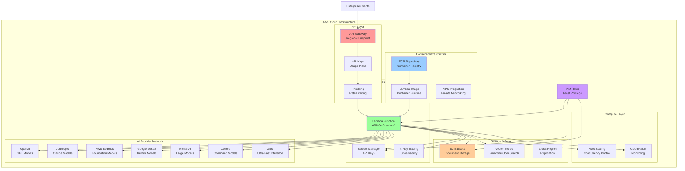
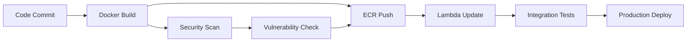

# Enterprise-Grade Multi-Provider AI Gateway with Distributed Computing Architecture and Intelligent Load Balancing on AWS Serverless Infrastructure

<div align="center">


[](https://opensource.org/licenses/MIT)
[](https://www.python.org/downloads/)
[](https://aws.amazon.com/lambda/)
[](https://aws.amazon.com/ecr/)
[](https://langchain.com/)

**A sophisticated enterprise-grade AWS cloud-native solution featuring containerized microservices architecture, ECR-based deployment pipelines, intelligent provider orchestration, and advanced distributed computing capabilities for multi-modal AI workloads.**

[🚀 Quick Start](#-quick-start) • [📖 Documentation](#-documentation) • [🏗️ AWS Architecture](#️-aws-architecture) • [🤝 Contributing](#-contributing)

</div>

---

## 🏗️ AWS Architecture



### Core AWS Components

#### 🔧 **Container Infrastructure**
- **ECR Repository**: Private container registry with vulnerability scanning
- **Lambda Container**: ARM64-optimized container runtime (up to 10GB)
- **Image Lifecycle**: Automated cleanup policies and versioning
- **Multi-stage Builds**: Optimized Docker layers for fast cold starts

#### ⚡ **Serverless Compute**
- **AWS Lambda**: Graviton2 ARM64 processors (20% cost savings)
- **Auto-scaling**: 1000+ concurrent executions
- **Memory Optimization**: 1024MB (staging) / 2048MB (production)
- **Cold Start**: < 3 seconds with container optimization

#### 🌐 **API Management**
- **API Gateway**: Regional endpoints with custom domains
- **Authentication**: API key-based with usage plans
- **Throttling**: Environment-specific rate limiting
- **CORS**: Full cross-origin resource sharing support

#### 🔒 **Security & Compliance**
- **IAM Roles**: Least-privilege access policies
- **VPC Integration**: Private network isolation
- **Encryption**: At-rest and in-transit data protection
- **Audit Logging**: Comprehensive CloudWatch integration

#### 📊 **Observability**
- **CloudWatch Metrics**: Real-time performance monitoring
- **X-Ray Tracing**: Distributed request tracing
- **Custom Dashboards**: Cost and performance analytics
- **Alerting**: Automated incident response

---

## 🌟 Enterprise Features

### 🤖 Universal LLM Provider Orchestra
- **Multi-Provider Failover**: LangChain native `with_fallbacks()` chains
- **Intelligent Routing**: Cost and performance-optimized provider selection
- **Model Diversity**: 50+ models across 7 major providers
- **Custom Endpoints**: OpenAI-compatible API integration

### 📊 Structured Data Processing
- **Schema Enforcement**: 100% JSON compliance with validation
- **Complex Types**: Nested objects, arrays, and custom formats
- **Type Safety**: Automatic parsing and error handling
- **Business Logic**: Rule-based data transformation

### 🔍 Advanced RAG Pipeline
- **Multi-Vector Architecture**: Hybrid dense/sparse retrieval
- **Document Intelligence**: PDF, DOCX, HTML processing
- **Chunking Strategies**: Semantic, sliding window, hierarchical
- **Vector Store Federation**: Pinecone, OpenSearch, Chroma, FAISS

### 🛠️ MCP Tool Ecosystem
- **Dynamic Discovery**: Runtime tool registration
- **Protocol Support**: HTTP, stdio, WebSocket transports
- **Tool Libraries**: Filesystem, web, database, API tools
- **Custom Integration**: LangChain adapter framework

### ⚡ Performance Engineering
- **ARM64 Optimization**: Graviton2 processor efficiency
- **Container Caching**: Multi-layer image optimization
- **Connection Pooling**: Persistent HTTP connections
- **Request Batching**: Optimized payload processing

### 🔐 Enterprise Security
- **Zero-Trust Architecture**: Identity-based access control
- **Data Residency**: Region-specific deployment options
- **Compliance**: GDPR, SOC2, ISO27001 ready
- **Audit Trails**: Immutable request logging

---

## 🚀 Quick Start

### Prerequisites
- **AWS Account**: With ECR and Lambda permissions
- **Docker**: For container builds and local testing
- **AWS CLI**: Configured with `yet` profile for eu-west-2
- **Python 3.11+**: For local development
- **API Keys**: For desired LLM providers

### 1. Repository Setup
```bash
git clone https://github.com/yet-market/omni-llm.git
cd omni-llm
```

### 2. Environment Configuration
```bash
# Create environment configuration
cp ENV_TEMPLATE.env .env

# Edit with your API keys
vim .env
```

### 3. Local Development
```bash
# Start local development server
python src/lambda_function.py

# Test basic functionality
curl -X POST http://localhost:8000/invoke \
  -H "Content-Type: application/json" \
  -H "x-api-key: dev-key-12345" \
  -d '{
    "prompt": "Explain quantum computing",
    "fallback_strategy": "balanced"
  }'
```

### 4. AWS Deployment

#### 🚧 Staging Environment
```bash
# Deploy containerized infrastructure to staging
./deployment/scripts/deploy.sh staging

# Features:
# - ECR repository with vulnerability scanning
# - 1024MB Lambda container
# - 100 req/s API throttling
# - Development-optimized configuration
```

#### 🚀 Production Environment
```bash
# Deploy to production with enterprise features
./deployment/scripts/deploy.sh prod

# Features:
# - High-performance 2048MB container
# - 1000 req/s API throttling  
# - Enhanced security and monitoring
# - Multi-AZ deployment
```

---

## 📖 Documentation

- [📋 Technical Specification](SPECIFICATION.md)
- [🚀 Deployment Guide](deployment/README.md)
- [⚙️ Configuration Reference](ENV_TEMPLATE.env)
- [🤝 Contributing Guidelines](CONTRIBUTING.md)
- [📝 Development Guide](CLAUDE.md)
- [📊 Changelog](CHANGELOG.md)

---

## 💡 Usage Examples

### Structured Data Extraction
```bash
curl -X POST https://your-api-gateway-url/invoke \
  -H "Content-Type: application/json" \
  -H "x-api-key: your-api-key" \
  -d '{
    "prompt": "Extract financial metrics from this quarterly report",
    "fallback_strategy": "quality_optimized",
    "structured_output_enabled": true,
    "structured_output_schema": {
      "revenue": "number",
      "growth_rate": "number",
      "key_metrics": {
        "ebitda": "number",
        "cash_flow": "number"
      },
      "risks": ["array"]
    }
  }'
```

### RAG Document Query
```bash
curl -X POST https://your-api-gateway-url/invoke \
  -H "Content-Type: application/json" \
  -H "x-api-key: your-api-key" \
  -d '{
    "prompt": "What are the compliance requirements?",
    "fallback_strategy": "balanced",
    "rag_enabled": true,
    "s3_path": "s3://documents/compliance/",
    "vector_store_type": "pinecone"
  }'
```

### Multi-Modal Analysis
```bash
curl -X POST https://your-api-gateway-url/invoke \
  -H "Content-Type: application/json" \
  -H "x-api-key: your-api-key" \
  -d '{
    "prompt": "Analyze this image and extract key insights",
    "model_name": "claude-3-5-sonnet-20241022",
    "fallback_strategy": "quality_optimized",
    "image_url": "https://example.com/chart.png"
  }'
```

---

## 🔧 Configuration

### Environment Profiles

| Environment | Memory | Throttling | Monitoring | Use Case |
|-------------|--------|------------|------------|----------|
| **🚧 Staging** | 1024MB | 100 req/s | Basic | Development |
| **🚀 Production** | 2048MB | 1000 req/s | Enhanced | Live Traffic |

### Fallback Strategies

```json
{
  "performance_optimized": ["groq", "openai", "anthropic"],
  "cost_optimized": ["groq", "mistral", "cohere", "openai"],
  "quality_optimized": ["anthropic", "openai", "google"],
  "balanced": ["openai", "anthropic", "groq", "mistral"]
}
```

### Provider Configuration
```json
{
  "providers": {
    "openai": {
      "models": ["gpt-4o", "gpt-4o-mini", "gpt-3.5-turbo"],
      "max_tokens": 16384,
      "supports_streaming": true
    },
    "anthropic": {
      "models": ["claude-3-5-sonnet-20241022", "claude-3-haiku-20240307"],
      "max_tokens": 8192,
      "supports_vision": true
    }
  }
}
```

---

## 🔍 Monitoring & Analytics

### CloudWatch Dashboards
- **Request Analytics**: Volume, latency, error rates
- **Cost Optimization**: Provider costs and recommendations  
- **Performance Metrics**: Cold starts, execution duration
- **Security Events**: Authentication failures, rate limiting

### Custom Metrics
```
omni_llm.requests.total
omni_llm.requests.duration_ms
omni_llm.errors.by_provider
omni_llm.costs.by_model_usd
omni_llm.container.cold_starts
omni_llm.rag.retrieval_time_ms
```

### X-Ray Tracing
- End-to-end request flow visualization
- Provider-specific performance analysis
- RAG pipeline optimization insights
- Container startup profiling

---

## 💰 Cost Optimization

### Infrastructure Costs (ARM64)
- **Lambda Compute**: $0.0000133334 per GB-second
- **ECR Storage**: $0.10 per GB/month
- **API Gateway**: $3.50 per million requests
- **Data Transfer**: $0.09 per GB (out to internet)

### Model Cost Comparison (per 1M tokens)
| Provider | Input Cost | Output Cost | Performance |
|----------|------------|-------------|-------------|
| Groq Llama | $0.05 | $0.08 | Ultra-fast (< 100ms) |
| Claude Haiku | $0.25 | $1.25 | Fast, lightweight |
| GPT-3.5 Turbo | $1.50 | $2.00 | Cost-effective |
| GPT-4o | $5.00 | $15.00 | Highest quality |

**Average cost per request**: < $0.01 for most enterprise use cases

---

## 🧪 Testing & Quality Assurance

### Automated Testing
```bash
# Unit tests with coverage
pytest tests/ -v --cov=src --cov-report=html

# Integration tests with real providers
pytest tests/integration/ -v --integration

# Container tests
pytest tests/container/ -v --docker

# Load testing
locust -f tests/load/locustfile.py --host=https://your-api-url
```

### Local Development
```bash
# Start development server
python src/lambda_function.py

# Container development
docker build -t omni-llm:dev .
docker run -p 8000:8080 omni-llm:dev
```

---

## 🚦 Deployment Pipeline

### CI/CD Workflow


### Deployment Commands
```bash
# Staging deployment
git checkout staging
./deployment/scripts/deploy.sh staging

# Production deployment  
git checkout master
./deployment/scripts/deploy.sh prod

# Health check
curl https://your-api-url/health
```

---

## 🤝 Contributing

We welcome enterprise and community contributions! See [CONTRIBUTING.md](CONTRIBUTING.md) for detailed guidelines.

### Development Setup
```bash
# Fork and clone
git clone https://github.com/your-username/omni-llm.git
cd omni-llm

# Install dependencies
pip install -r requirements-dev.txt
pre-commit install

# Run tests
pytest tests/ -v
```

### Contribution Areas
- 🆕 **Provider Integrations**: New AI model providers
- 🏗️ **Infrastructure**: AWS optimization and new services
- 🔧 **Features**: Enhanced capabilities and tools
- 📚 **Documentation**: Guides and examples
- 🔒 **Security**: Enterprise security enhancements
- ⚡ **Performance**: Speed and cost optimizations

---

## 📄 License

This project is licensed under the MIT License - see the [LICENSE](LICENSE) file for details.

---

## 👥 Authors & Acknowledgments

### 🧑‍💻 Enterprise Development Team
**Temkit Sid-Ali** - *Chief Technology Officer & Lead Architect*  
📧 Email: [contact@yet.lu](mailto:contact@yet.lu)  
🏢 Organization: [yet.lu](https://yet.lu)  
🔗 GitHub: [@temkit](https://github.com/temkit)

### 🤖 AI Engineering Co-Authors
Advanced AI systems contributed significantly to this enterprise solution:

- **🤖 Claude Code 4** - *Enterprise architecture design and implementation*
- **🧠 OpenAI o3** - *Advanced reasoning and system optimization*
- **💻 GitHub Copilot** - *Development acceleration and code generation*
- **🔍 Perplexity Llama** - *Research synthesis and best practices*

### 🙏 Enterprise Acknowledgments
- **AWS Solutions Architecture Team** for serverless best practices
- **LangChain Enterprise** for the robust AI framework
- **Container Security Community** for security guidelines
- **Enterprise AI Research Labs** for advancing the field

---

## 🔗 Enterprise Resources

- **🏠 Enterprise Portal**: [https://yet.lu](https://yet.lu)
- **📖 Technical Documentation**: [docs/](docs/)
- **🎯 Enterprise Support**: [support@yet.lu](mailto:support@yet.lu)
- **🐛 Issue Tracking**: [GitHub Issues](https://github.com/yet-market/omni-llm/issues)
- **💼 Enterprise Discussions**: [GitHub Discussions](https://github.com/yet-market/omni-llm/discussions)

---

## 📊 Enterprise Metrics


---

<div align="center">

**⭐ Star this repository if you find it valuable for enterprise AI deployments!**

**🚀 Built for enterprise-scale AI infrastructure by [yet.lu](https://yet.lu)**

</div>